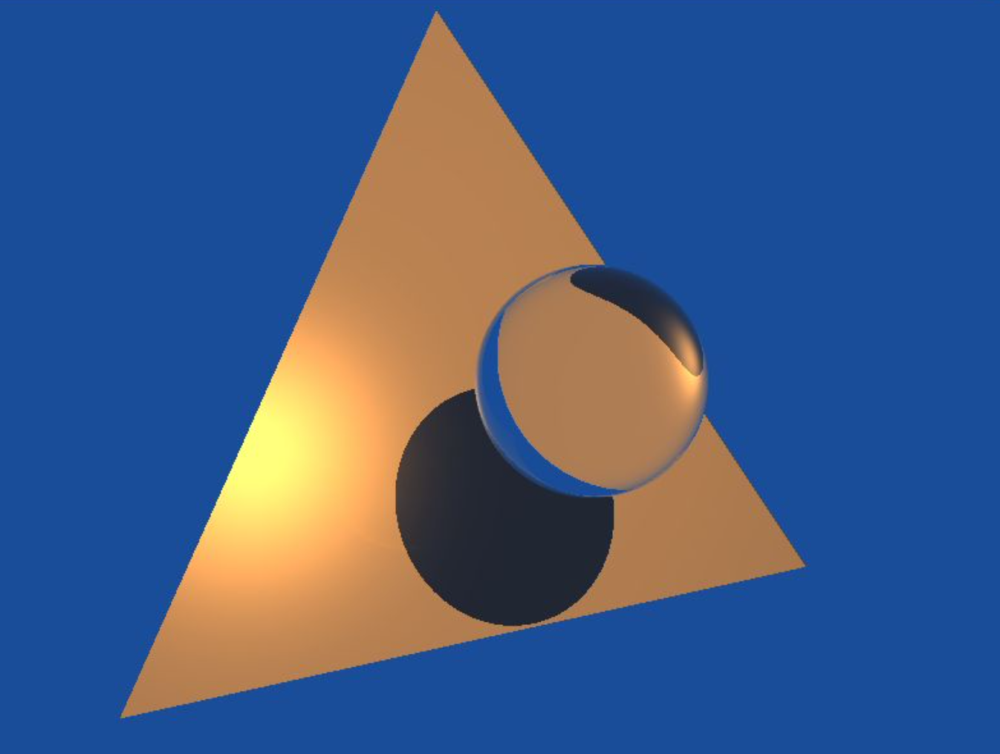

# Raytracing
Implement a raytracer and simulate real-life light interactions with objects (like shadows/reflections) while experimenting with rendering objects made up of different materials (like dielectrics or specular).

In this project we:
* Render a couple of objects in flat color.
* Simulate specular/shiny surfaces with Blinn-Phong shading.
* Render shadows.
* Simulate reflective and dielectric materials using Schlick’s approximation to Fresnel’s reflection.
* Simulate the attenuation of light while passing through dielectrics with Beer's law.

## Results
1. Rendering objects in flat color

2. Blinn-Phong shading:

3. Adding shadows:

4. Simulate reflection and refraction with specular and dielectric objects:
		Reflection               |  Refraction (Schlick’s approximation)
	  :-------------------------:|:-------------------------:
	    |  

5. Beer–Lambert law
		Refraction (Schlick’s approximation)               |  Refraction (Schlick’s approximation + Beer's Law)
	  :-------------------------:|:-------------------------:
	    |  

## Execution
* Generate the object file:
	* `mkdir build && cd build`
	* `cmake ..\`
	* `make`
	* `cd ../`
* Execute the object file:
	* `./bin/raytracer`